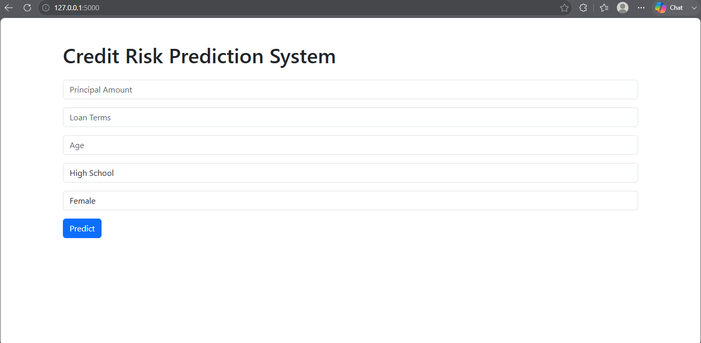
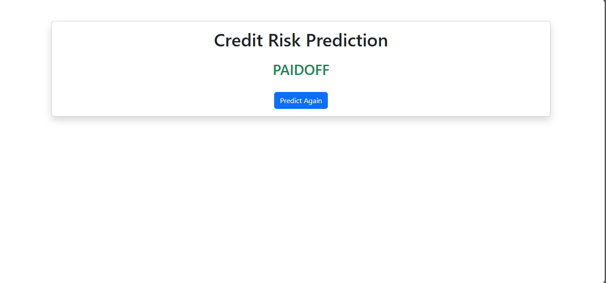
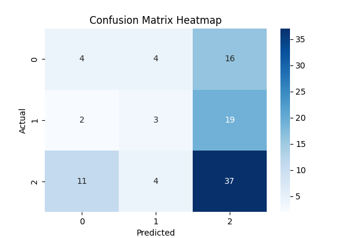
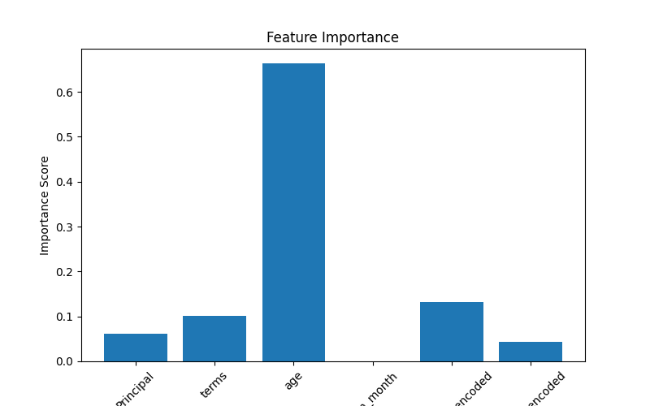
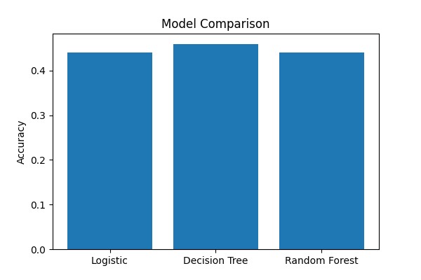

# CreditPathAI

Machine Learning Based Credit Risk Prediction System

## Overview

CreditPathAI is an end-to-end Machine Learning project that predicts loan repayment outcomes using historical credit data.

The project covers the complete ML lifecycle:

- Data Cleaning
- Exploratory Data Analysis (EDA)
- Feature Engineering
- Model Training
- Model Evaluation
- Flask Deployment
- Production Readiness Concepts

The objective is to assist financial institutions in assessing loan repayment risk and making better lending decisions.

---

## Features

- Credit Risk Prediction
- Data Cleaning Pipeline
- Exploratory Data Analysis
- Feature Engineering
- Logistic Regression
- Decision Tree
- Random Forest
- Hyperparameter Tuning
- Cross Validation
- Feature Selection
- Confusion Matrix Analysis
- Feature Importance Analysis
- Flask Web Application
- Prediction Logging
- Health Monitoring Endpoint
- Model Versioning
- Error Handling

---

## Tech Stack

### Machine Learning

- Python
- Pandas
- NumPy
- Scikit-Learn

### Visualization

- Matplotlib
- Seaborn

### Deployment

- Flask
- HTML
- Bootstrap

### Utilities

- Joblib

---

## Project Architecture

User
↓
Web Interface (HTML + Bootstrap)
↓
Flask Application
↓
Random Forest Model
↓
Prediction
↓
Result Display

---

## Machine Learning Pipeline

1. Data Collection
2. Data Cleaning
3. Exploratory Data Analysis
4. Feature Engineering
5. Train-Test Split
6. Model Training
7. Model Evaluation
8. Feature Selection
9. Model Persistence
10. Deployment

---

## Models Implemented

### Logistic Regression

- Baseline Model
- Simple and Interpretable

### Decision Tree

- Handles Non-Linear Relationships
- Easy to Visualize

### Random Forest

- Ensemble Learning Technique
- Better Generalization
- Reduced Overfitting

---

## Evaluation Metrics
python src/day21_advanced_evaluation.py

The project evaluates models using:

- Accuracy
- Precision
- Recall
- F1 Score
- Cross Validation
- Confusion Matrix
- Feature Importance

---

## Results

### Best Model Performance

Accuracy: 44%

### Key Findings

- Age is the strongest predictive feature.
- Loan Month contributes minimal predictive value.
- Dataset imbalance affects model performance.
- Random Forest provides stable predictions.

---

## Production Features

### Prediction Logging

Every prediction is stored in:

logs/predictions.log

### Health Monitoring Endpoint

Endpoint:

/health

Returns:

{
  "status": "healthy",
  "model": "loaded"
}

### Model Versioning

Current Model:

credit_risk_model_v1.pkl

### Error Handling

Graceful exception handling prevents application crashes.

---

## Project Structure

CreditPathAI

├── data/

├── models/

├── logs/

├── screenshots/

├── src/

├── templates/

├── requirements.txt

└── README.md

---

## Screenshots

### Home Page

### Prediction Result

### Confusion Matrix

### Feature Importance

### Model Comparison

## Installation

Clone the repository:

git clone <repository-url>

Move into the project folder:

cd CreditPathAI

Install dependencies:

pip install -r requirements.txt

Run the Flask application:

python src/day14_flask_app.py

Open:

http://127.0.0.1:5000

---

## Learning Outcomes

Through this project I learned:

- Data Cleaning
- Data Analysis
- Feature Engineering
- Model Training
- Model Evaluation
- Feature Selection
- Flask Deployment
- Production ML Concepts
- Logging and Monitoring
- Model Versioning

---

## Future Improvements

- Larger Dataset
- Better Feature Engineering
- ROC-AUC Evaluation
- Improved Model Performance
- Enhanced Dashboard

---

## Author

Vidhi Nema

Machine Learning | AI | Software Development